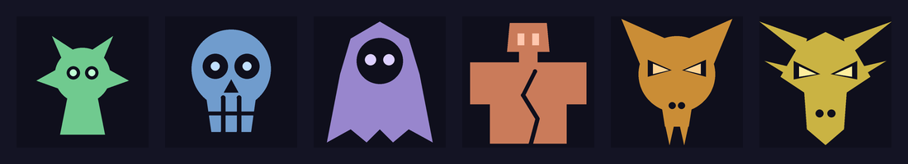

# 敵の姿




`lib/ui/foe_art.dart` の座標はここから生成している。**Dart を手で直さないこと。**

姿はラスター画像ではなく `CustomPainter` で描いている。盤面のマスは実機で
40〜50px しかなく、画像を置いても潰れて読めない。ベクターなら解像度に追従し、
アセット重量も増えず（web ビルドは CanvasKit だけで既に 1.5MB ある）、
色を `Palette.wardColorFor` から取れるので盤面の封印と必ず揃う。

姿は盤面の敵マス（封印の中）と、決着画面の両方に出る。盤面では 20px 前後まで
縮むので、形を直したら `python3 tools/foe/preview.py 20` のように小さい値でも
描いて、潰れていないか見ること。

## 直し方

リポジトリのルートから。Pillow だけあれば動く。

```bash
pip install pillow
python3 tools/foe/preview.py 160 tools/foe/sheet.png   # 上の並びを描き直す
python3 tools/foe/emit_dart.py               # lib/ui/foe_art.dart を書き換える
```

`shapes.py` を直す → `preview.py` で見る → 納得したら `emit_dart.py`。
書き出し先は `lib/ui/foe_art.dart` に固定してあるので、置き直す手間は無い。

プレビューは Pillow、実物は Flutter の Canvas という別の実装だが、読む座標は
`shapes.py` ひとつなので形はずれない。`preview.py` は 4 倍で描いて縮小している
（Pillow にアンチエイリアスが無いため）。

## 形の決まり

座標は 0〜1 の正方形。使える描画は3つだけで、これは Flutter の Canvas に
そのまま移せるものに絞ってある。

| | |
|---|---|
| `('poly', 層, [(x,y), ...])` | 閉じた多角形を塗る |
| `('circle', 層, (cx, cy, r))` | 円を塗る |
| `('line', 層, [(x,y), ...], w)` | 折れ線を太さ w・丸端で引く |

層は `fill`（本体）→ `hole`（くり抜き）→ `glow`（光る目）の順に描かれる。
くり抜きは背景色で塗るのではなく `BlendMode.clear` で抜くので、どの色の
パネルの上に置いても穴が背景とずれない。

## 格の梯子

守り 3〜8 に1体ずつ。**守りが厚い敵ほど枠を使い切る**ようにしてあるので、
同じ大きさの枠に並べると格の差が姿でも出る。色は `wardColorFor` の梯子と
同じものが自動で乗る。

| 守り | 敵 |
|---|---|
| 3 | 小鬼 |
| 4 | 骸 |
| 5 | 影 |
| 6 | 石像 |
| 7 | 獣 |
| 8 | 竜 |
